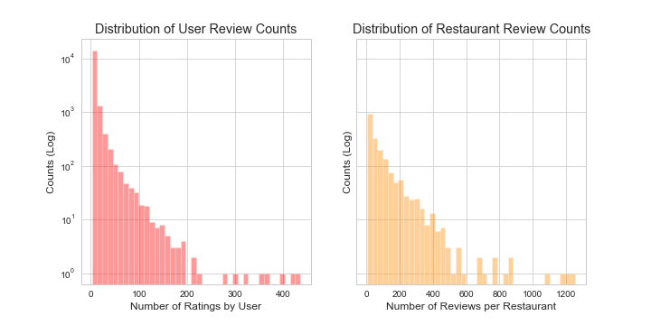
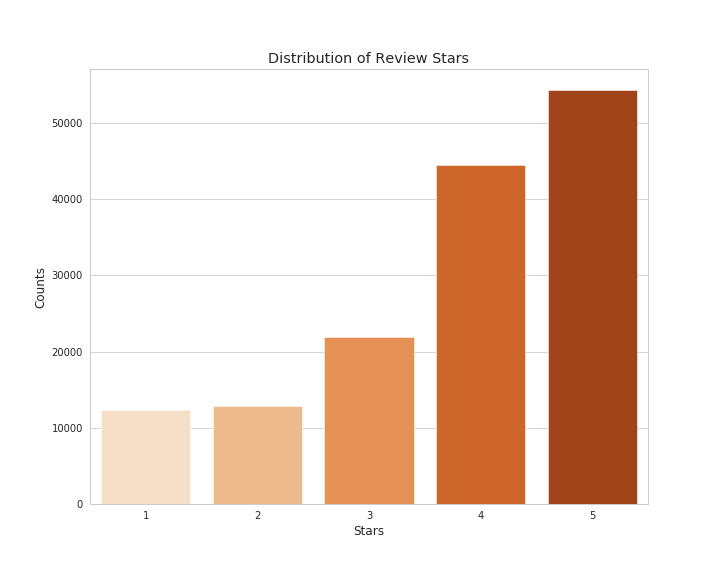
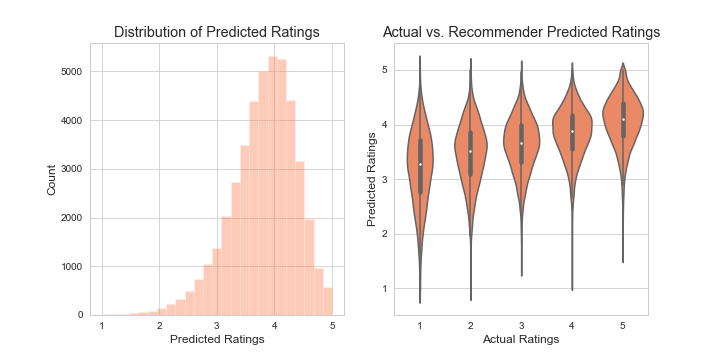
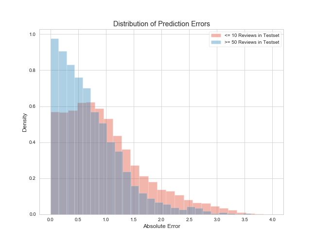

# Yelp Recommender: Restaurants in Charlotte
The goal of this project was to build an explicit recommender system using collaborative filtering for restaurants in Charlotte using [Yelp's Open Dataset](https://www.yelp.com/dataset). I wanted to explore the mechanics of recommendations systems, and explore a new library in [Surprise](http://surpriselib.com).

# Background & Goals
[Yelp](https://www.yelp.com/) is a website that allows users to leave reviews for businesses. These reviews contain both a text component and a numerical rating (they use 1-5 stars, whole values, with 5 being the highest). The site has recommendation systems, but most of the suggestions tend to be for other similar restaurants. I was interested in implementing a recommender that leveraged collaborative filtering in order to provide suggestions based on the explicit feedback of other users that are similar to the person using the system. In this way, the system captures not only individual interests but also variety. Charlotte was of particular interest as I spent my undergrad in the state of North Carolina (Go Duke!).

# Data
[Yelp's Open Dataset](https://www.yelp.com/dataset) contains 10GB of data split into 6 JSON files (businesses, reviews, users, checkins, tips, and photos). I was interested in the business, review, and user data, and after combining and trimming these tables to focus on reviews for open Charlotte restaurants, I was looking at 220,241 unique reviews; 78,494 unique users; 2,032 unique restaurants; and a data density of 0.14%. The most represented restaurant was [Tupelo Honey](https://tupelohoneycafe.com/location/charlotte/) with 2,103 reviews, and Abby was the most active user with 435 reviews to her name.

While I ran some basic models on this data in order to have baseline scores for comparison, I ended up trimming data to improve model performance. As recommenders need multiple reviews for users and restaurants to be effective, I cut out users with fewer than three reviews and restaurants that received fewer than three reviews. I didn't want to cut out too much data so I didn't go higher than this threshold, though making it 5 or 10 would have certainly improved performance. After this, I was looking at 146,135 unique reviews (down 34%); 16,718 unique users (down 79%); 1,933 unique restaurants (down 5%), and 0.45% data density (up 228%). The most reviewed restaurant became [Amelie's French Bakery & Café](https://ameliesfrenchbakery.com/) with 1,257 reviews, and Abby remained Yelp Charlotte's MVP.

Below are log-scale histograms showing the distributions of how many reviews users provide, and how many reviews restaurants have received. They show that the majority of users have provided a handful of reviews, and the majority of restaurants, likewise, have received a handful of reviews.  
  

Additionally, I've included a bar graph showing the distribution of review stars given. There's a very strong skew to the right. In some ways, it's encouraging because it shows that people are much more likely to leave positive reviews than negative ones. Unfortunately, this skew leads to some challenges in building an explicit recommender that I'll speak to shortly.  

# Results & Challenges
After iterating through and experimenting with several models in [Surprise](http://surpriselib.com), the one I ultimately saw the best performance in was [SVD++](https://surprise.readthedocs.io/en/stable/matrix_factorization.html#surprise.prediction_algorithms.matrix_factorization.SVDpp). It is a form of UV decomposition that takes into account user & item biases, learning rates for each of these biases, a regularization term, and implicit ratings (it weighs not only the numerical rating given, but also that a user even rated the item, regardless of that rating). I've included a table to show how models performed in comparison to one another on a 70/30 test/train split - for reference, there were 182 users and 3 restaurants that were present in the trainset and not the testset. Models marked ** were made with the data prior to being trimmed to have models for comparison. 
| Model | RMSE | MAE |
| ---- | ---- | ---- |
| **Random | 1.800 | 1.429 |
| **Baseline | 1.236 | 1.004 |
| NMF | 1.275 | 0.974 |
| Funk SVD | 1.129 | 0.895 |
| SVD++ | 1.117 | 0.884 | 

While this achieved my lowest MAE & RMSE, this model is off by .88, almost a full star, in terms of average absolute error on predictions. RMSE is a similar metric that punishes larger errors. So then, what can we discover about where the model is struggling most?  
  

The generated predictions are normally distributed with a hard skew to the right. The model is working to replicate mostly high values, but ultimately there's a discrepency since the actual reviews are neither normally nor evenly distributed. The violin plot shows that the model really struggles with approximating low scores. When the actual rating is 1, it's predicting on average scores closer to 3.5 with a lot of variation to these scores.  
  

There are also differences in how the model performs depending on how much data there is to work with in the trainset. When users have no more than 10 reviews in the trainset, we see that the errors are regularly higher than when we have at least 50 reviews in the trainset. This makes sense - the more data there is on users, the more likely we are to be able to make accurate predictions.

Overall, I thought these failures were more encouraging than discouraging. While making more accurate predictions on the lower end is ideal, the goal of a recommender is to provide recommendations based on the highest valued predictions. Similarly, knowing errors are worse when less data is present suggests that the model could be improved either by having more user data or by further trimming down the user/restaurant minima outlined in [Data](#data).

In researching these shortcomings, I found an article by [Mansoury et al](https://arxiv.org/pdf/1907.07766.pdf) which speaks to how explicit recommenders inherently skew toward centrality, and that a lack of flatness in the ratings correlates negatively to performance. In this same paper, they propose converting user ratings into percentiles based on their own rating preferences in pre-processing in order to flatten these ratings. I only partially explored this alternative, but see it as a next step worth investigating.

Ultimately, the goal was to create recommendations based on user ratings, and I've included below an example of such a recommendation.  
[Recommendation example](images/recommendation.png)  

What we can see is that our recommender is picking up on the user's interests in Mediterranean food by offering other similar style restaurants, presumably from other users who enjoy Mediterranean food. Places like Chili Man and Enat Ethiopian show up because they are popular, highly rated restaurants.

# Technologies
* Python (including NumPy, Pandas, Matplotlib, Seaborn, and Surprise)
* Amazon EC2

# Looking Forward
I consider this project foundational in my understanding and implementation of recommender systems. Looking forward, here are some things I'd like to explore:
* Creating user interactivity, either through a self-contained Python class and/or a Flask app
* Further researching ways to handle skewed, non-evenly distributed data
* Adjusting the recommendation system to ensure that there's serendipity and variety, and that smaller businesses with fewer reviews are represented
* Building a hybrid recommender that also takes into account the text content of reviews

# Acknowledgements
A big thanks to Dan Rupp, Juliana Duncan, Peter Galea, and Austin Penner, each of whom poured a lot of their time and energy in helping me complete this project. Thanks to [Yelp](https://www.yelp.com/dataset) for making their dataset available. Additionally, several publications helped me in understanding the theory behind recommenders and test metrics:
* [Mansoury et al's "Flatter is better: Percentile Transformations for Recommender Systems"](https://arxiv.org/pdf/1907.07766.pdf)
* [Wllmott & Matsuura's "Advantages of the mean absolute error (MAE) over the root mean square error (RMSE) in assessing average model performance"](https://www.int-res.com/articles/cr2005/30/c030p079.pdf)
* [Chai & Draxler's "Root mean square error (RMSE) or mean absolute error (MAE)? – Arguments against avoiding RMSE in the literature"](https://www.researchgate.net/profile/Tianfeng_Chai/publication/272024186_Root_mean_square_error_RMSE_or_mean_absolute_error_MAE-_Arguments_against_avoiding_RMSE_in_the_literature/links/54e3776f0cf2b2314f5d2f3c/Root-mean-square-error-RMSE-or-mean-absolute-error-MAE-Arguments-against-avoiding-RMSE-in-the-literature.pdf).
